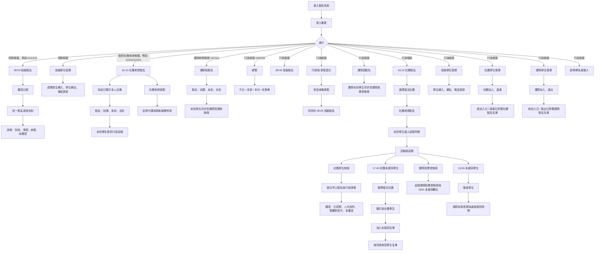
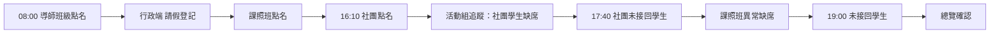

# 博嘉點名系統工作流程說明書

適用期間：115-1 課外社團，2026/08/31-2026/12/24
系統入口：開啟點名系統網址後，先登入帳號密碼。
資料儲存：點名、請假、未接回與名冊異動資料會同步到 Firebase 雲端共用資料庫；本機瀏覽器會保留暫存作為備援。

## 一、給導師的版本

### 導師登入

導師進入系統後，只會看到自己班級相關功能。

範例：

| 身分 | 帳號 | 密碼 | 進入後看到 |
|---|---:|---:|---|
| 一年甲班導師 | 101 | 101 | 08:00 班級點名、班級學生管理 |

### 08:00 班級點名流程

1. 登入系統。
2. 系統會直接進入自己的班級點名畫面。
3. 確認日期是否正確。
4. 逐一確認學生狀態：
   - 到校
   - 事假
   - 病假
   - 其他
5. 如果全班都到，可以按「全到」。
6. 若按「全到」後才發現有學生未到，只要再針對該學生改成正確狀態即可，不需要重新點全班。
7. 如果行政端已先登記某位學生事假或病假，導師按「全到」時不會覆蓋該學生的請假狀態。

### 班級學生管理

導師可以在「班級學生管理」中查看自己班級學生。

可處理情況：

| 情況 | 處理方式 |
|---|---|
| 新生轉入 | 新增學生，填入入班日期 |
| 學生預計轉出 | 將狀態改為已轉出，填入轉出日期 |
| 電話更新 | 直接修改電話欄位 |

重要規則：

如果學生預計 8 月 20 日轉出，8 月 17 日到 8 月 19 日點名時仍會出現在班級名單；從 8 月 20 日開始才不出現在點名名單。

## 二、給社團老師的版本

### 社團老師登入

社團老師使用個別帳號登入，帳號與密碼相同。登入後只會看到自己負責的「16:10 社團老師點名」與「社團老師請假」，不會看到其他社團。

| 身分 | 帳號 | 密碼 | 進入後看到 |
|---|---:|---:|---|
| 桌球老師 | 12101 | 12101 | 桌球社（週一）的 16:10 社團老師點名、社團老師請假 |
| 陶藝老師 | 12102 | 12102 | 陶藝（週一）的 16:10 社團老師點名、社團老師請假 |
| 烏克麗麗老師 | 12103 | 12103 | 烏克麗麗（週一）的 16:10 社團老師點名、社團老師請假 |

### 16:10 社團點名流程

1. 登入系統。
2. 系統會直接進入自己負責的「16:10 社團老師點名」。
3. 確認點名日期是否正確。
4. 系統只顯示自己負責的社團名單。
5. 逐一確認學生狀態：
   - 到課
   - 未到
6. 如果全社團學生都到，可以按「全到」。
7. 若按「全到」後才發現有學生未到，只要再針對該學生改成「未到」即可。
8. 社團老師完成點名後，未到學生會提供給行政端後續追蹤。

### 社團老師請假流程

1. 在左側選擇「社團老師請假」。
2. 請假日期選擇自己的社團上課日，社團名稱會固定為自己負責的社團。
3. 填寫請假原因，並選擇「安排代課」或「本日課程延後至期末補課週」。
4. 選擇安排代課時，顯示「不需補課」；代課老師姓名與連絡電話可在送出前補齊。
5. 選擇期末補課時，系統顯示自動建議的補課日期；星期五社團不能安排期末補課。
6. 送出後等待行政端審核。退回的申請可以編輯後重新送出，或直接刪除。

### 社團老師權限

社團老師帳號只負責自己社團的點名與社團老師請假。

共用帳號 `121/121` 已停用。完整社團帳密對照表請見「權限連結說明.md」。

不會看到：

- 08:00 班級點名
- 行政端 請假登記
- 活動組追蹤
- 17:40 社團未接回學生
- 19:00 未接回學生
- 其他社團的點名與請假紀錄
- 班級學生管理
- 社團學生管理
- 課照學生管理

## 三、給課照老師的版本

### 課照老師登入

課照老師登入後，只會看到「課照班點名」。

| 身分 | 帳號 | 密碼 | 進入後看到 |
|---|---:|---:|---|
| 課照老師 | 111 | 111 | 課照班點名 |

### 課照班點名流程

1. 登入系統。
2. 系統會直接進入「課照班點名」。
3. 確認點名日期是否正確。
4. 從下拉選單選擇年段：
   - 一二年級
   - 三四年級
   - 五六年級
5. 逐一確認學生狀態：
   - 到課
   - 未到
6. 如果該年段課照學生都到，可以按「全到」。
7. 標記未到學生後，會同步到行政端「課照班異常缺席」。

### 課照老師權限

課照老師帳號只負責課照班點名。

不會看到：

- 08:00 班級點名
- 行政端 請假登記
- 16:10 社團點名
- 活動組追蹤
- 17:40 社團未接回學生
- 19:00 未接回學生
- 班級學生管理
- 社團學生管理
- 課照學生管理

## 四、給行政人員的版本

### 行政登入

| 身分 | 帳號 | 密碼 |
|---|---:|---:|
| 行政人員 | 159 | 159 |

行政人員可看到完整功能列。

### 新學期名冊匯入

此功能僅限行政帳號 `159/159` 使用。

1. 進入「新學期名冊匯入」。
2. 上傳與現有「全校學生名單.xlsx」相同格式的 Excel。
3. 系統先顯示班級人數、新增、異動、不續用學生及錯誤資料。
4. 缺少學號、班級、座號、姓名，或出現重複學號、重複班級座號時，系統禁止正式匯入。
5. 電話未填時，同學號學生會保留目前電話。
6. 確認名冊正確後，勾選「直接清除測試點名紀錄，且不建立備份」。
7. 按「正式匯入並清除測試紀錄」，115-1 名冊自 2026/08/17 生效。

正式匯入會直接清除目前的班級、課照、社團點名、追蹤、未接回及手動名冊測試資料，無法還原。Excel 尚未通過檢查前不會清除任何資料。

### 每日早上流程

1. 導師完成 08:00 班級點名。
2. 若家長直接打電話到學輔處或教研中心請假，行政人員進入「行政端 請假登記」。
3. 搜尋學生並登記事假、病假或未確認。
4. 行政登記完成後，會同步到 08:00 班級點名結果。
5. 行政端已登記為事假或病假的學生，導師在 08:00 班級點名按「全到」時仍會保留請假狀態。

### 16:10 社團點名流程

1. 社團老師或行政人員進入「16:10 社團點名」。
2. 系統依日期顯示當天有課的社團。
3. 選擇社團後進行點名。
4. 如果全社團都到，可以按「全到」。
5. 標記未到學生後，系統會提供後續追蹤使用。

### 課照班點名流程

1. 課照老師或行政人員進入「課照班點名」。
2. 系統顯示 115 學年度上學期課照學生名冊。
3. 先用下拉選單選擇一二年級、三四年級或五六年級。
4. 課照老師逐一標記到課或未到。
5. 如果該年段課照學生都到，可以按「全到」。
6. 未到學生會同步到「課照班異常缺席」。

### 活動組追蹤

「活動組追蹤」用來處理社團學生缺席。

系統會結合：

| 資料來源 | 用途 |
|---|---|
| 08:00 班級點名 | 判斷學生早上是否已到校或已請假 |
| 16:10 社團點名 | 判斷學生社團是否未到 |
| 行政端 請假登記 | 補上家長直接向行政請假的資訊 |

活動組可在「社團學生缺席」中記錄：

- 已請假
- 人在校內其他地點
- 聯繫家長中
- 未確認
- 備註

### 17:40 社團未接回學生

1. 進入「17:40 社團未接回學生」。
2. 畫面先不顯示學生名單。
3. 從「當天社團」下拉選單選擇社團。
4. 系統會顯示該社團學生名單。
5. 點選需要列入未接回的學生。
6. 按「完成」後，收回學生名單。
7. 已加入的學生會留在下方未接回名單中。

### 課照班異常缺席

此頁用於追蹤課照班點名後標記為未到、且早上 08:00 並非事假或病假的學生。

目前欄位包含：

| 日期 | 班級 | 學生 | 課照班 | 缺席狀態 | 1900 未接回學生 | 備註 |
|---|---|---|---|---|---|---|

### 19:00 未接回學生

1. 進入「19:00 未接回學生」。
2. 搜尋學生。
3. 加入未接回名單。
4. 填寫電話、負責老師與最後接回時間。

### 社團學生管理

處理學生社團加退選。

| 情況 | 處理方式 | 點名規則 |
|---|---|---|
| 學生預計加入社團 | 填入加入日期 | 加入日期前不出現在社團點名，加入日起出現 |
| 學生預計退選 | 狀態改為已退選，填入退選日期 | 退選日期前仍出現在社團點名，退選日起不出現 |
| 電話更新 | 由班級學生管理更新電話 | 舊紀錄會顯示最新電話 |

### 課照學生管理

處理課照班學生加入與退出。

初始測試名冊先由全校名單抽樣：

- 一年級 5 位、二年級 5 位
- 三年級 5 位、四年級 5 位
- 五年級 5 位、六年級 5 位
- 適用期間：2026-08-17 到 2026-12-31

| 情況 | 處理方式 | 點名規則 |
|---|---|---|
| 學生預計加入課照班 | 填入加入日期 | 加入日期前不出現在課照點名，加入日起出現 |
| 學生預計退出課照班 | 狀態改為已退出，填入退出日期 | 退出日期前仍出現在課照點名，退出日起不出現 |
| 電話更新 | 由班級學生管理更新電話 | 舊紀錄會顯示最新電話 |

## 五、網站操作架構圖

## 六、每日建議作業順序

